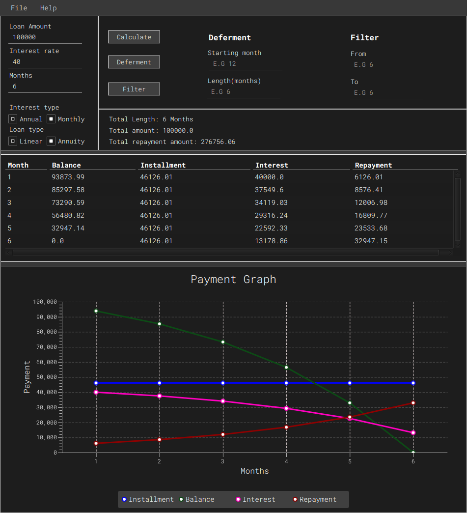

# Mortgage Visualizer

Visualize mortgage repayments, show amortization table, calculate with a deferment period, filter through results



## Dependencies

- Java 11
- For runtime you'll need `javafx-sdk-11.0.2`(included)
- Run with modules `javafx.controls,javafx.fxml`

## Running
```
$ git clone
$ cd mortgage-visualizer
$ java -agentlib:jdwp=transport=dt_socket,server=n,suspend=y,address=localhost:38665 --module-path lib --add-modules javafx.controls,javafx.fxml -Dfile.encoding=UTF-8 com.main.App
```
